# 기술스택

- BE
    - IntelliJ
    - SpringBoot 2.7.3
    - Spring Data JPA
    - mySql 8.0.30
    - Java 11
    - Gradle 7.5
    - Hadoop
- ML
    - Scikit-Learn
- FE
    - VSCode, figma, Vue3, BootStrapVue3, node.js, Javascript
- Infra
    - Docker, Jenkins, AWS EC2
- Team Collaboration Tool
    - Jira, gitLab, notion, webex, MatterMost, SourceTree

# 시연시나리오

## 1. 전국 질병 지도

- 좌측 상단의 버튼을 눌러서 원하는 질병의 정보를 선택할 수 있습니다.
  
    
    
- 가운데 지도의 지역을 선택하면 해당 지역의 정보를 선택하면
  
    
    
- 좌측 5대 질병 버튼 아래에 선택한 지역의 위험도 정보를 확인할 수 있습니다.
  
    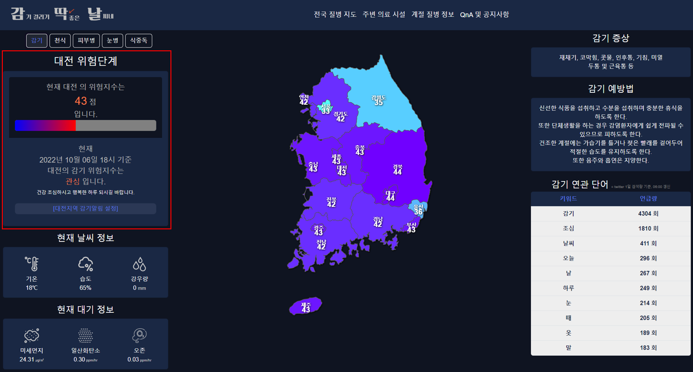
    
- 선택한 지역의 위험도 정보칸의 알림 설정 버튼을 클릭하면
  
    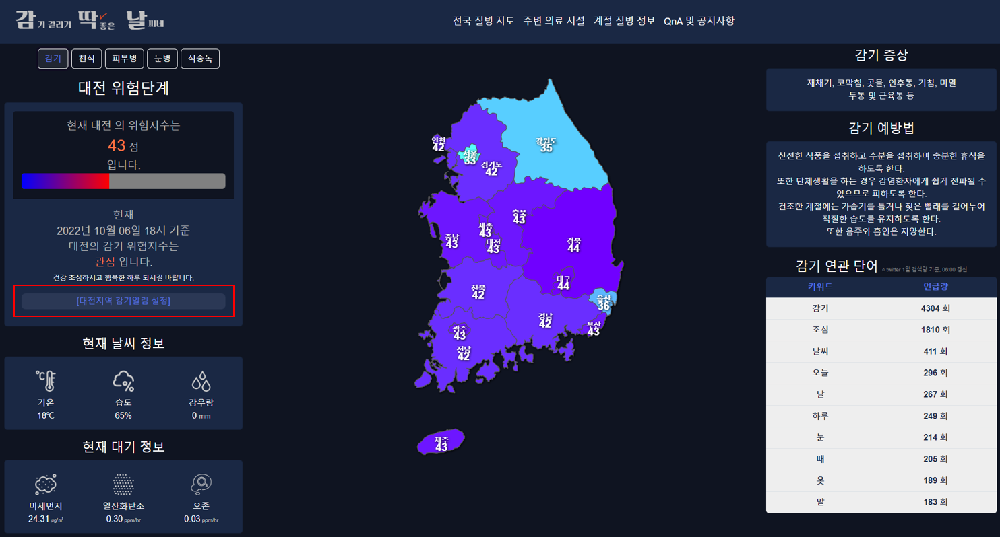
    

 

- 전화번호를 입력하면 SMS 문자 알림 정보 서비스를 받을 수 있습니다.
  
    
    
    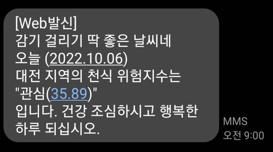
    
- 좌측 하단에는 선택한 지역의 현재 날씨 정보와 대기 정보를 확인할 수 있습니다
  
    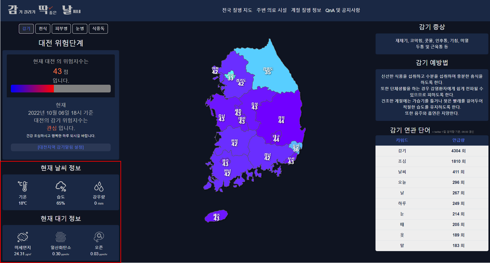
    
- 우측 상단에는 선택한 질병의 증상과 예방법 정보를 확인할 수 있습니다.
  
    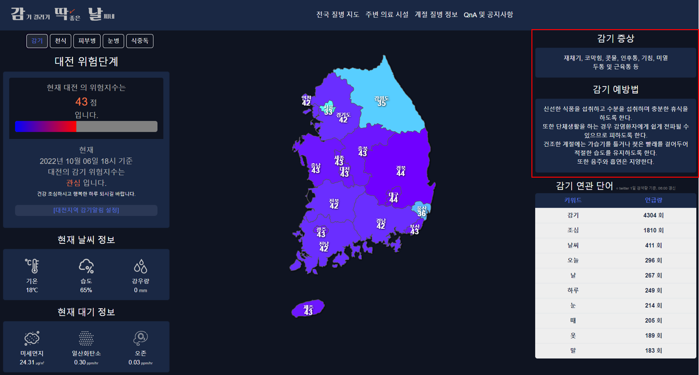
    
- 우측 하단에는 선택한 질병과 연관된 단어의 언급 순위 정보를 확인할 수 있습니다.
  
    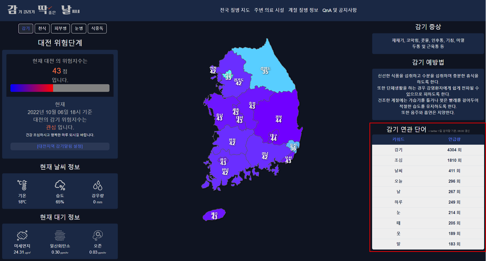

### 한장으로 요약하기

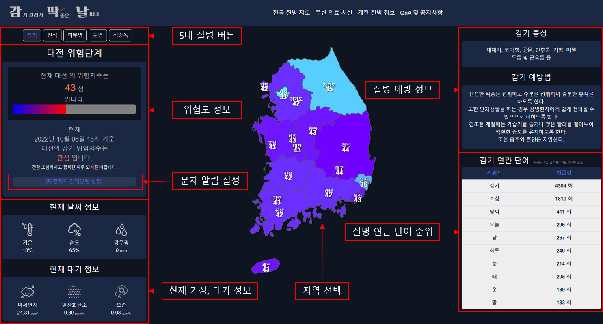

## 2. 주변 의료 시설

- 좌측 상단 버튼을 누르면 해당 카테고리의 정보를 지도상에서 확인할 수 있습니다.

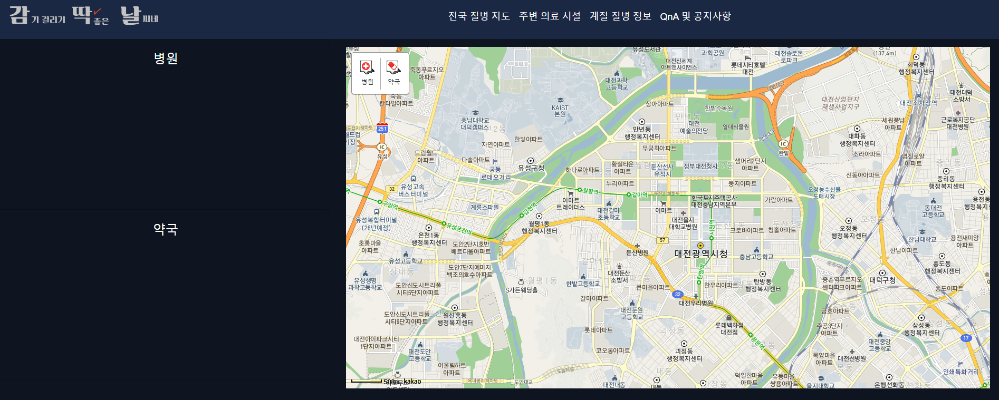

- 마커를 클릭하면 해당 지점의 정보가 나오며, 카카오 지도로 이동 가능합니다.

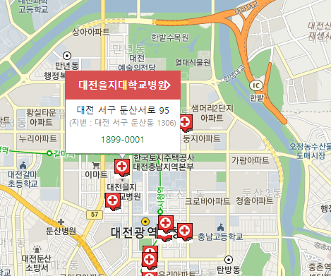

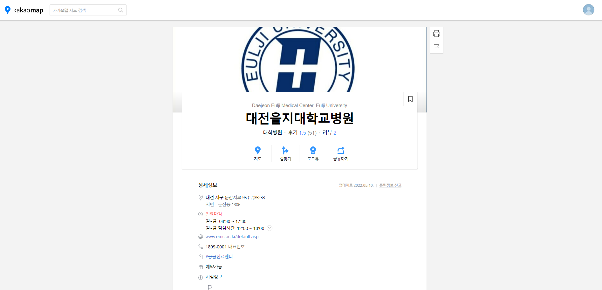

### 주의사항 : 마커를 한 번 더 눌러야 꺼지므로 반드시 한번 더 눌러서 끄고 설명을 이어간다.

- 좌측 상단 카테고리를 누르면 활성화된 마커는 다시 사라집니다.

- 또한, 카테고리를 활성하면 좌측에 리스트가 생기며, 이름과 전화번호 등의 간략한 정보를 알 수 있습니다.

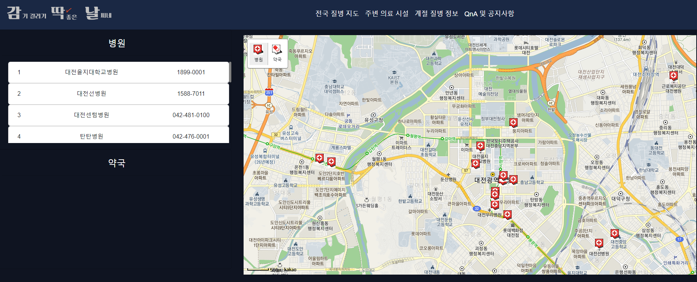

- (지도를 이동하거나 확대, 축소하며) 지도를 확대하거나 축소하거나 또는 이동을 할 경우 해당 상태에 맞는 병원과 약국 위치를 다시 검색해 주며, 좌측의 리스트 또한 갱신됩니다.

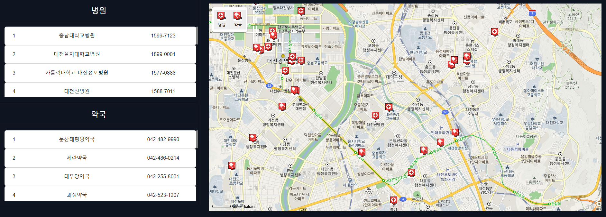

### 한장으로 요약하기

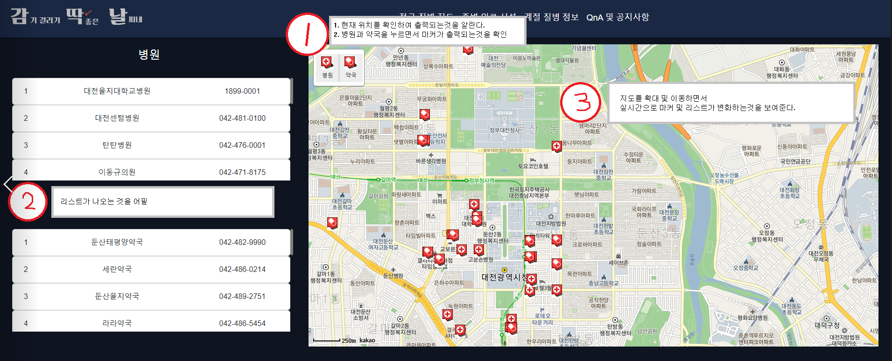

## 3. 계절 질병 정보

1. 계절 질병 정보입니다.
2. 원하는 계절을 선택할 수 있습니다.
3. 선택한 계절과 간단한 주의사항이 적혀있습니다.
4. 해당 계절에 대한 정보를 모달을 통해 띄워줍니다.

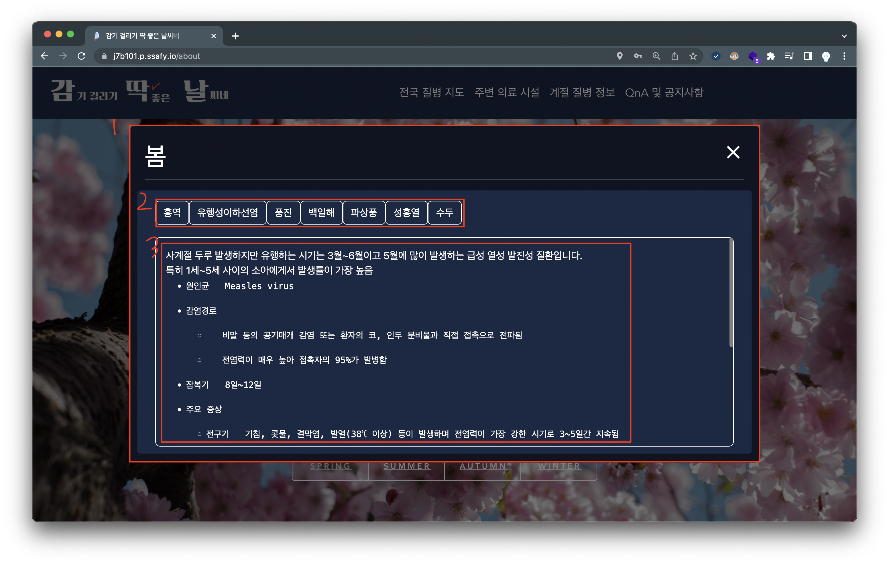

1. 선택한 계절의 질병 정보를 담은 모달창입니다.
2. 주로 유행하는 질병명이 나와있고, 선택할 수 있습니다.
3. 해당 질병에 대한 특징과 설명이 나와있습니다.
